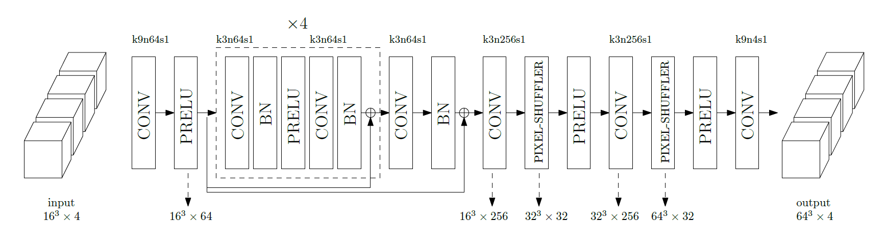

## Turbulence Enrichment using Generative Adversarial Networks
Project category: GANs

| **Team members**     | **SUID**   |
|:---------------------|:----------:|
| Raunak Borker        | rborker    |
| Sravya Nimmagadda    | sravya     |
| Akshay Subramaniam   | akshays    |
| Man-Long Wong        | wongml     |

### What and why
Turbulent flow is important in many engineering applications. However, simulating turbulence is very computationally expensive due to extremely high resolution requirements. Large Eddy Simulations (LES) that simulate only the large scales have become popular due much lower cost, but require explicit modeling of the small scales. Here, we propose to enrich LES data by populating it with small scales obtained using a Generative Adversarial Network (GAN).

Modeling turbulence accurately is extremely challenging especially in capturing high order statistics due to its intermittent nature. GANs have been shown to perform better than other data driven approaches like PCA in capturing high order moments [[1]](https://arxiv.org/pdf/1708.01810.pdf). In addition, generating physically realistic realizations are important for physical simulation data; a constraint not present when using generative models for images. Incorporating this constraint into the GAN framework would be crucial to its performance.

### Data
The data was generated using an in-house fluid flow simulation code (PadeOps) which was run on a compute cluster using 256 processors for multiple days. A time-evolving simulation was performed on a 64x64x64 uniform grid and the output was collected every few time steps to make our dataset. The output is comprised of four fields --- three components of the velocity vector (u, v, w) and one of the pressure (p) each of size 64x64x64. 

### Methodology
We are using GANs[[2]](https://arxiv.org/pdf/1406.2661.pdf) in a fashion similar to super-resolution applications for image data [[3]](https://arxiv.org/pdf/1609.04802.pdf). We plan to also include the physics realizability constraint through a term in the loss function similar to the physics informed deep learning method in [[4]](https://arxiv.org/pdf/1711.10561.pdf).

Preliminary ResNet:

### Plan
In chronological order we plan to do the following for the completion of our project:
1. Implement the discriminator network with architecture similar to that in [[3]](https://arxiv.org/pdf/1609.04802.pdf).
2. The ResNet will now be the generator with the loss function composed of the content loss and an adversarial loss. The adversarial loss used will be the one defined in Wasserstein GAN [[5]](https://arxiv.org/abs/1701.07875), which is shown to overcome mode collapse as well as provide a metric to monitor training progress.  
3. Train and test the resulting GAN.
4. Implement the aforementioned physics based loss into the generator loss function. 
5. Train and test the resulting GAN.
6. Evaluate our network on a set of low-resolution flow fields and measure the performance of the generated high-resolution flow fields by computing the energy spectra, two-point velocity correlations, and the mass conservation. 

### References
[1] Chan, Shing, and Ahmed H. Elsheikh. "Parametrization and Generation of Geological Models with Generative Adversarial Networks." arXiv preprint arXiv:1708.01810 (2017).

[2] Goodfellow, Ian, et al. "Generative adversarial nets." Advances in neural information processing systems. 2014.

[3] Ledig, Christian, et al. "Photo-realistic single image super-resolution using a generative adversarial network." arXiv preprint (2016).

[4] Raissi, Maziar, Paris Perdikaris, and George Em Karniadakis. "Physics Informed Deep Learning (Part I): Data-driven Solutions of Nonlinear Partial Differential Equations." arXiv preprint arXiv:1711.10561 (2017).

[5] Arjovsky, Martin, Soumith Chintala, and Léon Bottou. "Wasserstein gan." arXiv preprint arXiv:1701.07875 (2017)

### Evaluation
To evaluate our results quantitatively, we will quantify energy spectra, statistical moments and physical realizability errors. We will also plot the generated flow data and compare qualitatively to the high-resolution ground truth.
