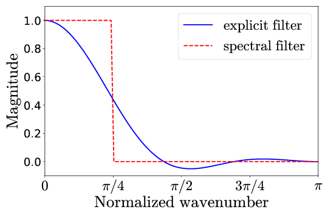
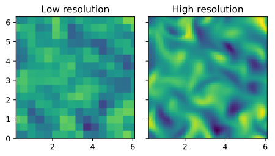
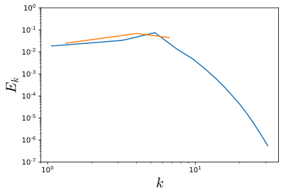
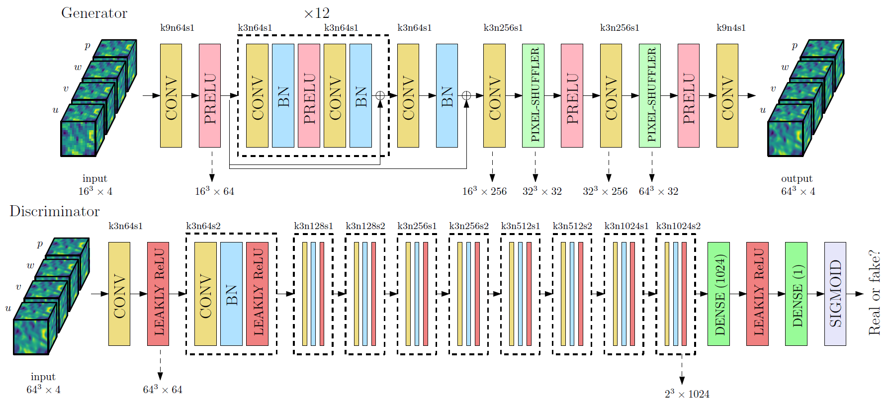
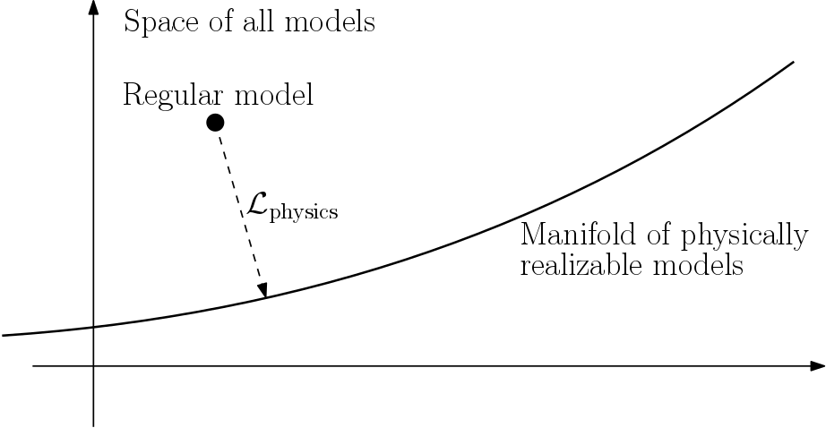
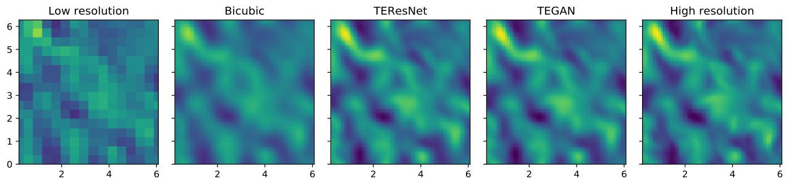
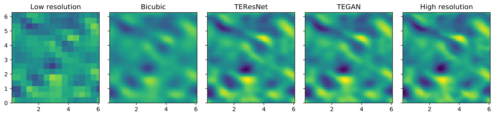
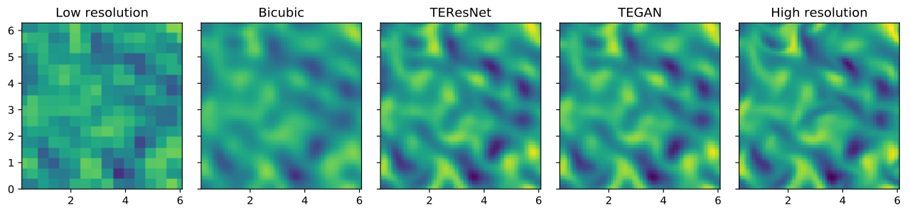
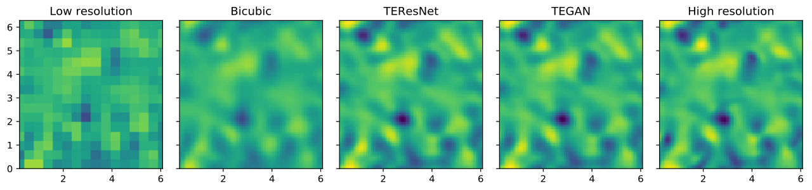
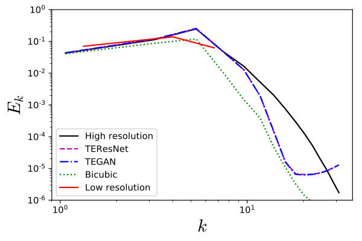

# Turbulence Enrichment using Generative Adversarial Networks

## What and why
Turbulent flow is important in many engineering applications. However, simulating turbulence is very computationally expensive due to extremely high resolution requirements. Large Eddy Simulations (LES) that simulate only the large scales have become popular due much lower cost, but require explicit modeling of the small scales. Here, we propose to enrich LES data by populating it with small scales obtained using a Generative Adversarial Network (GAN).

Modeling turbulence accurately is extremely challenging especially in capturing high order statistics due to its intermittent nature. GANs have been shown to perform better than other data driven approaches like PCA in capturing high order moments [[1]](https://arxiv.org/pdf/1708.01810.pdf). In addition, generating physically realistic realizations are important for physical simulation data; a constraint not present when using generative models for images. Incorporating this constraint into the GAN framework would be crucial to its performance. The constraint is given by the governing equations for the incompressible flow given below:

## Data
We generated data for this work using an in-house fluid flow simulation code (PadeOps) which was run on a compute cluster using 256 processors for multiple days. We performed a time-evolving simulation on a 64x64x64 uniform grid and collected snapshots separated in time by more than one integral time scale. The output is comprised of four fields --- three components of the velocity vector  and one of the pressure  each of size .

Low-resolution data is generated by filtering the HR data down to  using the explicit filter shown below that's derived as a best approximation to the sharp spectral filter.

Comparison of the high-resolution (top) and low resolution (bottom) data:

Comparison of the power spectral density of the high-resolution (blue) and low-resolution (orange) data:

The  datasets are split into  train,  dev and  test sets.

## Model
For the task of upsampling the low resolution data in a physically consistent manner, we use a GAN[[2]](https://arxiv.org/pdf/1406.2661.pdf) in a fashion similar to super-resolution applications for image data [[3]](https://arxiv.org/pdf/1609.04802.pdf). 

The generator has a deep residual network architecture with each residual block having convolutional layers with batch normalization. The discriminator has a deep convolutional architecture with fully connected layers in the end for binary classification. The architectures of the generator and discriminator are depicted pictorially below:

### Loss Functions
The flow field is constrained by the continuity and pressure Poisson equations:

The above equations might not be satisfied exactly by the model's generated output. To combat this, the residual of the above equations can be used as a regularizer for the model through a physics loss.

The loss function minimized for the generator network during training is a combination of

* **Content loss**: 

: Mean squared error between the high resolution and generated fields

: Mean squared error in the derived enstrophy field  () to sensitize the generator to high frequency content

* **Physics loss**: 

Residuals of the continuity () and pressure Poisson () equations given above similar to [[4]](https://arxiv.org/pdf/1711.10561.pdf).

* **Adversarial loss**: 

To train the discriminator, we use the logistic loss based on predicted labels for real and generated data.

### Training

#### TEResNet
A model with just the residual generator network without the adversarial component is termed TEResNet. We first train TEResNet to convergence and tune hyperparameters like the number of residual blocks and the physics loss parameters.

#### TEGAN
The model with both the residual network generator and the discriminator depicted above is termed TEGAN. The generator in TEGAN is first initialized using the weights from the trained TEResNet while the discriminator is initialized using the Xavier-He initialization. 

For the first few iterations in the training process (~300), the discriminator alone is trained to negate the advantage that the generator has because of its pre-trained weights. Then, both the generator and discriminator are trained together with the active adversarial loss until the losses saturate and the discriminator's output saturates at 0.5.

## Model Performance

<table align="center">
  <tr>
    <td></td>
    <td colspan="2"><b>Content loss</b></td>
    <td colspan="2"><b>Physics loss</b></td>
  </tr>
  <tr>
    <td></td>
    <td><b>Dev</b></td>
    <td><b>Test</b></td>
    <td><b>Dev</b></td>
    <td><b>Test</b></td>
  </tr>
  <tr>
    <td><b>TEResNet</b></td>
    <td>0.049</td>
    <td>0.050</td>
    <td>0.078</td>
    <td>0.085</td>
  </tr>
  <tr>
    <td><b>TEGAN</b></td>
    <td>0.047</td>
    <td>0.047</td>
    <td>0.070</td>
    <td>0.072</td>
  </tr>
  <tr>
    <td><b>% difference</b></td>
    <td>4.1</td>
    <td>6.0</td>
    <td>10.3</td>
    <td>15.2</td>
  </tr>
</table>

## References
[1] Chan, Shing, and Ahmed H. Elsheikh. "Parametrization and Generation of Geological Models with Generative Adversarial Networks." arXiv preprint arXiv:1708.01810 (2017).

[2] Goodfellow, Ian, et al. "Generative adversarial nets." Advances in neural information processing systems. 2014.

[3] Ledig, Christian, et al. "Photo-realistic single image super-resolution using a generative adversarial network." arXiv preprint (2016).

[4] Raissi, Maziar, Paris Perdikaris, and George Em Karniadakis. "Physics Informed Deep Learning (Part I): Data-driven Solutions of Nonlinear Partial Differential Equations." arXiv preprint arXiv:1711.10561 (2017).

[5] Arjovsky, Martin, Soumith Chintala, and Léon Bottou. "Wasserstein GAN." arXiv preprint arXiv:1701.07875 (2017)

## People
Raunak Borker, Sravya Nimmagadda, Akshay Subramaniam and Man-Long Wong
